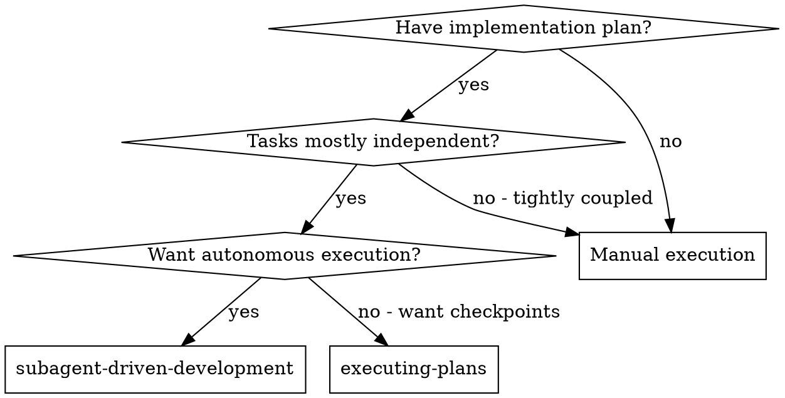
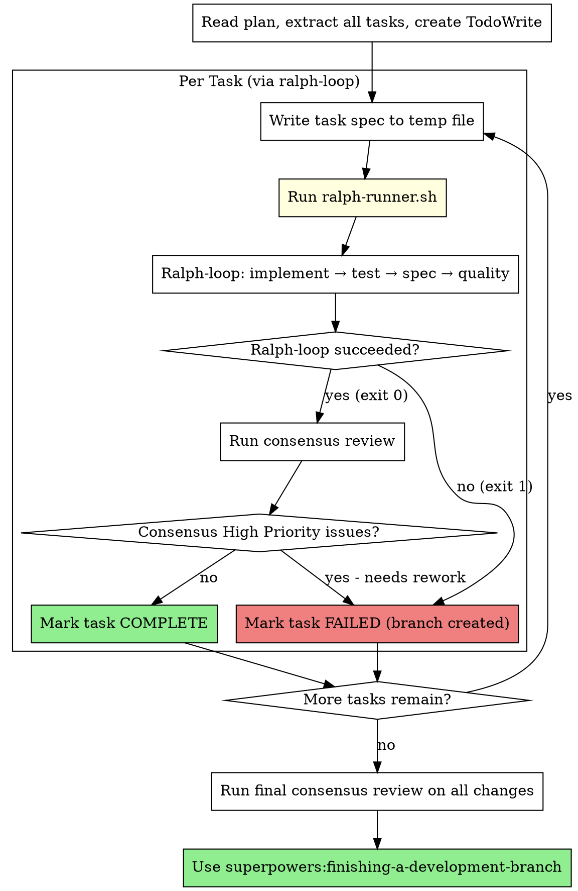

# Subagent-Driven Development

Execute plan by running each task through **ralph-loop** for autonomous iteration with fresh context, then consensus review.

**Core principle:** Fresh context per iteration (ralph-loop) + consensus review = autonomous, high-quality task completion

## Ralph Loop Integration

Each task runs through `ralph-runner.sh`:
- **Fresh context:** Each iteration is a clean `claude -p` invocation (no polluted context)
- **Iteration cap:** Max 5 attempts per task (configurable)
- **Stuck detection:** Same error 3x = try different approach or abort
- **Failure branches:** If cap hit, branch failed work and continue to next task
- **Gates:** Tests → Spec compliance → Code quality (all automated)

After ralph-loop succeeds, consensus review validates the work.

## When to Use



**Key difference from executing-plans:**
- Fully autonomous (ralph-loop handles retries)
- Fresh context per iteration (no conversation pollution)
- Failed tasks get branched and skipped (plan continues)

## The Process



## Task Execution

For each task in the plan:

### Step 1: Write Task Spec

```bash
# Create temp file with task spec
TASK_SPEC=$(mktemp --suffix=.md)
cat > "$TASK_SPEC" << 'EOF'
# Task: [task name]

## Context
[Scene-setting: what this task is part of, what exists already]

## Requirements
[Full task requirements from plan]

## Success Criteria
- [ ] [criterion 1]
- [ ] [criterion 2]
- [ ] All tests pass
- [ ] Code committed

## Files
- Create/Modify: [file paths from plan]
- Test: [test file paths]
EOF
```

### Step 2: Run Ralph Loop

```bash
# Run task through ralph-loop (autonomous iteration)
./skills/ralph-loop/ralph-runner.sh \
    "task-name" \
    "$TASK_SPEC" \
    --non-interactive \
    -d "$(pwd)"

RALPH_EXIT=$?
```

Ralph-loop handles internally:
1. **Implement:** Fresh `claude -p` with task spec + previous failure context
2. **Test gate:** Auto-detect and run tests (npm/cargo/pytest/go)
3. **Spec gate:** Fresh `claude -p` to verify spec compliance
4. **Quality gate:** Run linters (soft - warnings only)
5. **Retry:** If any hard gate fails, iterate with fresh context
6. **Stuck detection:** Same error 3x triggers strategy shift directive
7. **Failure branch:** If cap hit, create `wip/ralph-fail-{task}-{timestamp}` branch

### Step 3: Consensus Review (if ralph-loop succeeded)

```bash
if [ $RALPH_EXIT -eq 0 ]; then
    # Ralph-loop succeeded, run consensus review
    ./skills/multi-agent-consensus/auto-review.sh "Completed task: [task name]"

    # Check for High Priority issues
    # If High Priority: mark task failed, continue
    # If no High Priority: mark task complete
fi
```

### Step 4: Update TodoWrite

```bash
if [ $RALPH_EXIT -eq 0 ] && [ no_high_priority_issues ]; then
    # Mark task COMPLETE in TodoWrite
else
    # Mark task FAILED in TodoWrite
    # Failure branch already created by ralph-loop
fi
```

## Example Workflow

```
You: I'm using Subagent-Driven Development to execute this plan.

[Read plan file: docs/plans/feature-plan.md]
[Extract all 5 tasks]
[Create TodoWrite with all tasks]

━━━━━━━━━━━━━━━━━━━━━━━━━━━━━━━━━━━━━━━━
Task 1: Hook installation script
━━━━━━━━━━━━━━━━━━━━━━━━━━━━━━━━━━━━━━━━

[Write task spec to /tmp/task-1-spec.md]
[Run: ./skills/ralph-loop/ralph-runner.sh "hook-install" "/tmp/task-1-spec.md" --non-interactive]

Ralph Loop: hook-install
Max iterations: 5
========== Iteration 1/5 ==========
[1/3] Implementation... (fresh claude -p)
[2/3] Running tests... PASS
[3/3] Spec compliance review... PASS
[soft] Code quality check... 0 warnings
========================================
SUCCESS: hook-install completed in 1 iteration
========================================

[Run consensus review]
Consensus: High Priority: None. Approved.

[Mark Task 1 COMPLETE ✓]

━━━━━━━━━━━━━━━━━━━━━━━━━━━━━━━━━━━━━━━━
Task 2: Recovery modes
━━━━━━━━━━━━━━━━━━━━━━━━━━━━━━━━━━━━━━━━

[Write task spec to /tmp/task-2-spec.md]
[Run: ./skills/ralph-loop/ralph-runner.sh "recovery-modes" "/tmp/task-2-spec.md" --non-interactive]

Ralph Loop: recovery-modes
========== Iteration 1/5 ==========
[1/3] Implementation...
[2/3] Running tests... FAIL
FAIL: update_state "tests" 1 "expected 'fixed' got 'broken'"
========== Iteration 2/5 ==========
[1/3] Implementation... (fresh context + previous error)
[2/3] Running tests... PASS
[3/3] Spec compliance... FAIL (missing progress reporting)
========== Iteration 3/5 ==========
[1/3] Implementation... (fresh context + spec feedback)
[2/3] Running tests... PASS
[3/3] Spec compliance... PASS
[soft] Code quality... 1 warning (magic number)
========================================
SUCCESS: recovery-modes completed in 3 iterations
========================================

[Run consensus review]
Consensus: High Priority: None. Medium: Extract constant. Approved.

[Mark Task 2 COMPLETE ✓]

━━━━━━━━━━━━━━━━━━━━━━━━━━━━━━━━━━━━━━━━
Task 3: Rate limiting (fails)
━━━━━━━━━━━━━━━━━━━━━━━━━━━━━━━━━━━━━━━━

[Write task spec to /tmp/task-3-spec.md]
[Run ralph-loop...]

Ralph Loop: rate-limiting
========== Iteration 1/5 ==========
[2/3] Running tests... FAIL (race condition)
========== Iteration 2/5 ==========
[2/3] Running tests... FAIL (race condition)
========== Iteration 3/5 ==========
STUCK: Same error 3 times
[2/3] Running tests... FAIL (race condition)
========== Iteration 4/5 ==========
[2/3] Running tests... FAIL (different approach, still fails)
========== Iteration 5/5 ==========
[2/3] Running tests... FAIL
========================================
CAP HIT: rate-limiting failed after 5 iterations
========================================
Creating failure branch: wip/ralph-fail-rate-limiting-20260121-123456
Failed work preserved in branch: wip/ralph-fail-rate-limiting-20260121-123456

[Mark Task 3 FAILED ✗ - branch: wip/ralph-fail-rate-limiting-20260121-123456]
[Continue to Task 4...]

━━━━━━━━━━━━━━━━━━━━━━━━━━━━━━━━━━━━━━━━
... Tasks 4-5 ...
━━━━━━━━━━━━━━━━━━━━━━━━━━━━━━━━━━━━━━━━

[After all tasks]
[Run final consensus review on all completed work]
[Use superpowers:finishing-a-development-branch]

Summary:
- Completed: 4/5 tasks
- Failed: 1 task (rate-limiting)
  - Branch: wip/ralph-fail-rate-limiting-20260121-123456
  - Error: Race condition in token bucket
  - Iterations: 5/5, stuck on same error
```

## Advantages

**Fresh context per iteration:**
- No polluted context from failed attempts
- Each retry starts clean
- Can break out of stuck patterns

**Autonomous execution:**
- No human-in-loop during task execution
- Ralph-loop handles all retries
- Failed tasks get branched and skipped

**Forward progress guaranteed:**
- Iteration cap prevents infinite loops
- Failed tasks don't block plan
- Failure branches preserve work for later

**Quality gates:**
- Tests must pass (hard gate)
- Spec compliance verified (hard gate)
- Code quality checked (soft gate)
- Consensus review after success

## Configuration

Environment variables (passed to ralph-loop):

| Variable | Default | Description |
|----------|---------|-------------|
| `RALPH_TIMEOUT_IMPLEMENT` | 1200s | Implementation timeout |
| `RALPH_TIMEOUT_TEST` | 600s | Test timeout |
| `RALPH_TIMEOUT_GLOBAL` | 3600s | Overall loop timeout |
| `RALPH_STUCK_THRESHOLD` | 3 | Same error count before stuck |

## Red Flags

**Never:**
- Skip consensus review after ralph-loop succeeds
- Proceed with High Priority consensus issues
- Run multiple ralph-loops in parallel (git conflicts)
- Manually intervene during ralph-loop execution
- Skip failed tasks without creating failure branch

**If ralph-loop fails:**
- Failure branch already created
- Mark task FAILED in TodoWrite
- Continue to next task
- Don't try to fix manually

**If consensus finds High Priority issues:**
- Mark task as needing rework
- Could re-run ralph-loop with additional context
- Or mark FAILED and continue

## Integration

**Required:**
- **superpowers:ralph-loop** - Autonomous iteration engine
- **superpowers:multi-agent-consensus** - Consensus review
- **superpowers:finishing-a-development-branch** - Complete development

**Plan source:**
- **superpowers:writing-plans** - Creates the plan this skill executes

## Files

- `./implementer-prompt.md` - Reference for task spec format (used by ralph-loop internally)
- `./spec-reviewer-prompt.md` - Reference for spec review (used by ralph-loop internally)
- `./code-quality-reviewer-prompt.md` - Reference for quality review
